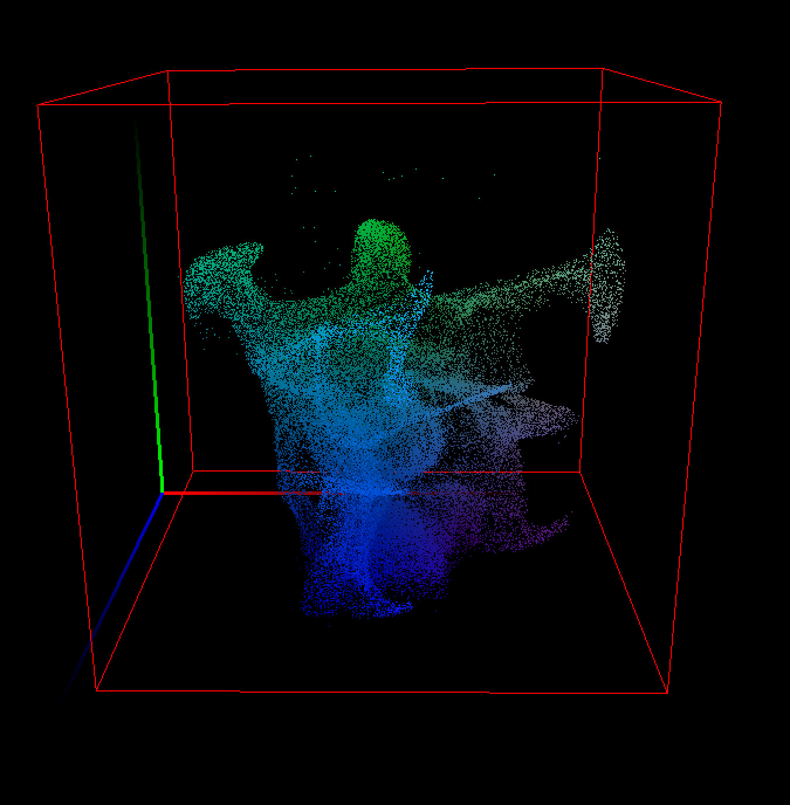

# Laplacian Eigenfunctions
<p >
   
</p>

This project implements Laplacian eigenfunction computations in 2D/3D using C++ and FFTW for spectral operations. It also uses OpenMP for parallelization and depends on additional libraries such as libjpeg and Accelerate (for macOS).

## Requirements

Before building, ensure that you have the following dependencies installed:

- **Clang/LLVM**  
  The project builds using `clang++` with libc++. It is recommended to use the Xcode Command Line Tools on macOS.

- **libomp (OpenMP)**  
  Install via Homebrew:
  ```bash
  brew install libomp
  ```

- **FFTW 3**  
  Install via Homebrew:
  ```bash
  brew install fftw
  ```
  FFTW is used for computing fast Fourier transforms.

- **libjpeg or jpeg-turbo**  
  Install via Homebrew:
  ```bash
  brew install jpeg-turbo
  ```
  This library is used for reading/writing JPEG images.

- **OpenGL / GLUT / Accelerate**  
  On macOS these are provided by the system frameworks. Ensure that you have Xcode Command Line Tools installed.

## Setup Instructions

1. **Clone the Repository**

   ```bash
   git clone https://github.com/aadjones/LaplacianEigenfunctions.git
   cd LaplacianEigenfunctions
   ```

2. **Create Required Directories**

   The project expects the following directories to exist:
   - `bin/` – for the final executable(s).
   - `data/` – for any output or intermediate data files.

   Create these directories (if they don’t exist) by running:

   ```bash
   mkdir -p bin data
   ```

3. **Build Configuration**

   The build system uses a Makefile and an `include.mk` file to manage compiler and linker flags. The current configuration assumes:
   - Usage of `clang++` with `libc++`.
   - Installation paths for FFTW and jpeg-turbo via Homebrew.
   - OpenMP support via libomp.
   - The Accelerate framework is used for BLAS operations on macOS.

   Adjust paths and versions as necessary.

4. **Building the Project**

   From the project root, run the following command to compile all project binaries:

   ```bash
   make
   ```

   The resulting executables (`laplacianEigen2D`, `laplacianEigen3D`, and `laplacianEigenFFTW2D`) will be placed in the `bin/` directory.

## Running the Executable

Once built, run the executable(s) from the project root:

```bash
./bin/laplacianEigen2D cfg/laplacian.3.cfg
```

The config file should specify parameters such as resolution, viscosity, timestep, and output paths. There are a handful of config files already present in the cfg/ directory.

- **License:**  
  This project is licensed under the GNU General Public License (GPL). See the LICENSE file for details.

